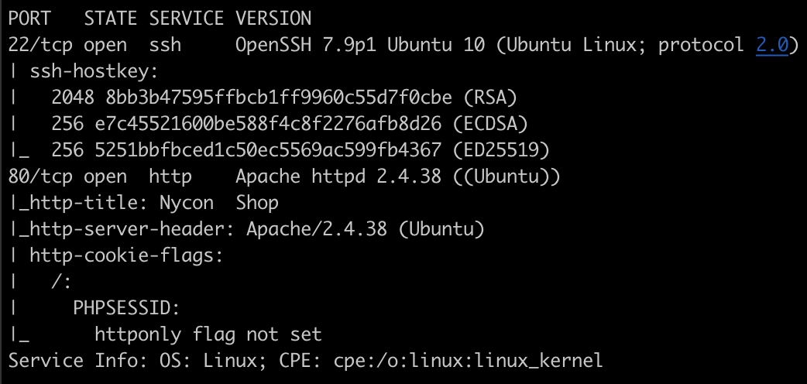
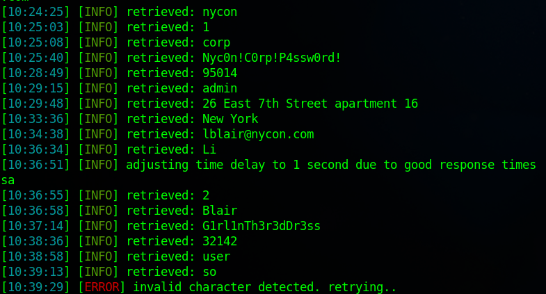
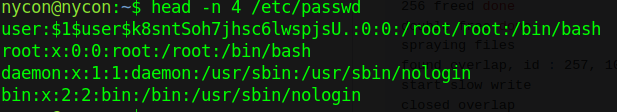

# Nycon
This root to boot involes exploting an Sql Injection vulnerability when updating your chart. Privelage escalation 
is achieved by triggering a double free on the route4_filer object. 

## NMAP

 
 

 
 ##SQL Injection
After crawling the website we notice that if we add an item to our cart the script update-cart.php is called. Here the id= parameter will accept arbitrary input. After some testing we can find that it is vulnerabel to a blind time based sql injeciton. If we supply the url to sqlmap we will be able to enumerate the db to find two users with cleartext passwords

 
 

 
With the credentials for the user "nycon" we are able to log in through ssh.

# Privilege Escalation
After looking through the directories we dont see anything intresting so we will transfer over linpeas to further enumerate the host machine. Linpeas does show us that the machine could be vulnerable to a sed SUID exploit. If we check GTFObins we will find some commands to break out of retricted shells but this is not what we are looking for. Linpeas also shows us that the machine could be vulnerable to CVE-2022-2588. If we check github we can find a POC exploit that we will need to comile on our machine then transfer over. Running the exploit will create a new user with root privileges

 
 

