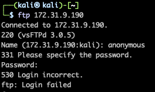

# JB CTF
 A simple Linux web server with some lateral movement opportunities as well as some common Linux misconfigurations.
 
 ## NMAP
 

 
 

 
 ## Enumeration
 First thing I checked was if we could log in with anonymous on ftp
 

 
 

 When that didnt work i tried to move on to the webserver. The way this ctf was set up I needed to set up ssh port forwarding. We redirect port 80 from the vulnerable machine to our proxy on our local host using the command ssh -L 8080:172.31.9.190:80 kali@18.189.145.207 -i Kali.pem. Once we have our port forwarded set up we can navigate to the webpage on our local mahcin. We just find a default apache landing page here. Running go buster we discover the directory /dev. Here there is a note with a username on it
 

 
 

 Now we can brute force ftp with the username. Now we find an shh key that we can use to conenct to the machine.
 
 ## Lateral Movement 
 We cant run sudo as this user so we will need to look for a way to move laterally. In the r.martinez directory we find a script that backs up files. We can edit this script to get a shell on the mahcine as the user r.martinez
 

 
 

 As r.martinez we are able to move into chads_stuff directory and here there is a note telling us that we have additonal permissions. 
  

 
 

 Knowing that we can try to cd into the other directories and inside of c.barney we find a note telling us there is a hidden file with a password hint
  

 
 

 if we ls -a we get the hint for the password
  

 
 

 ## Priv Esc
 We can use this hint to su to c.barney and checking our sudo abilities we see we can run python and reports.py as sudo. Running reports will generate our root shell
  

 
 

