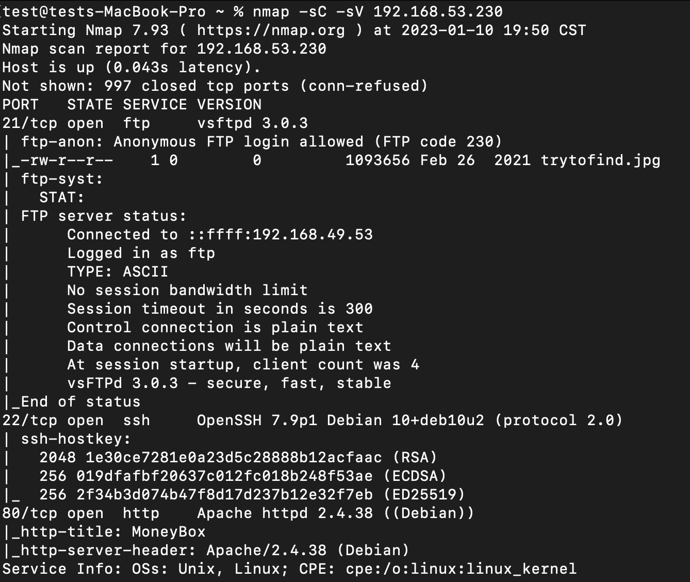
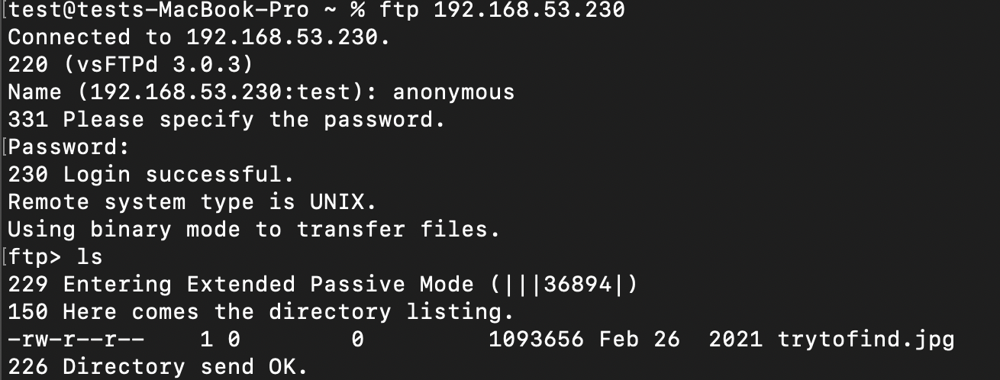
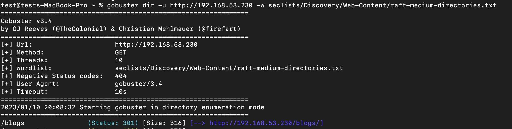
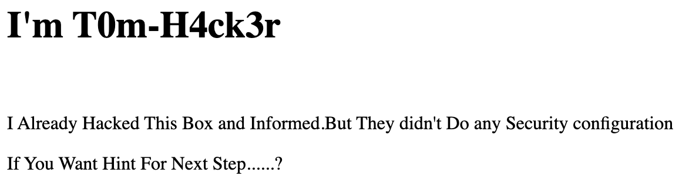
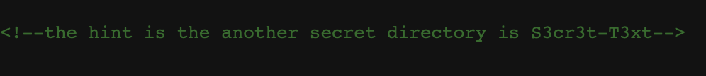
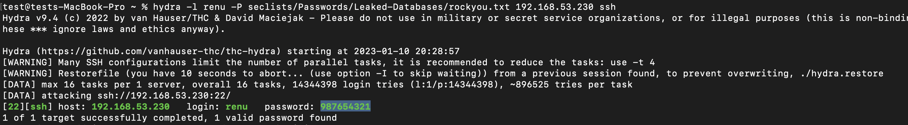
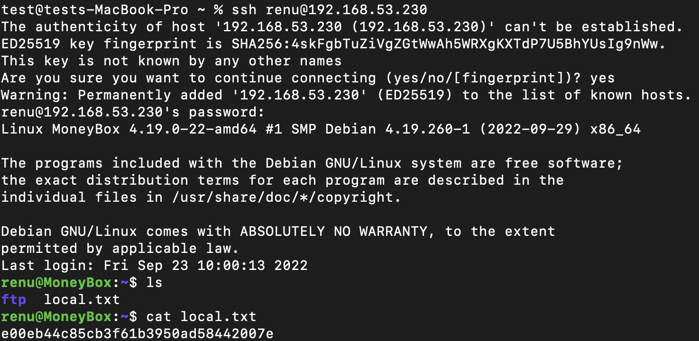

# MoneyBox
This is an easy box on Proving Grounds Play 
 

## Nmap
 

 
 

 
 ## Enumeration 
 The first port that draws our attention is ftp. Nmap says that we are able to log in anonymously but th eonly thing we find isa jpeg.

 

 
 

 
 We will leave that for now and explore the web server. After running go buster we find a blog diretory. 
 
 

 
 

 
 Navigating to the page we see a message from a previous hacker.
 
 

 
 

 
 If we view the page source here we can see a comment on the source code.
 
 

 
 

 
 Navigating to the secret directory we find another seemingly empyt page, but viewing soure code agian we find a secret key. We nothing else to use the key with, we revist the jpeg from the ftp server. IF we use steghid and the key we are able to see a message that a user renu has a weak password. With the username we found we can try to brute force ssh with hydra. 
 
 

 
 

 
 ## Intial Foothold
 
 With the creds we get from Hydra we can log into ssh with renu and grab the userflag 
 
 

 
 

 First thing we want to do is check to see if we can run anything as sudo. Seeing that we cant use sudo we will try to transfer over linpeas to search for escaltion paths.
 
 ## Lateral Movement
 
 Linpeas shows us that the box 
 
